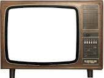

<body>
    <h1>/root/vscode/Nighthawk-Pages/images/download.jpg</h1>
    <a href="https://jkaeshim.github.io/Nighthawk-Pages/2023/10/12/MovieImproved_IPYNB_2_.html">
        <button></button>
    </a>
</body>

<!DOCTYPE html>
<html>
<head>
  
</head>
<body>
  <!-- The button element with the image appearance -->
  <button class="image-button" id="myButton"></button>

  
</body>
</html>
